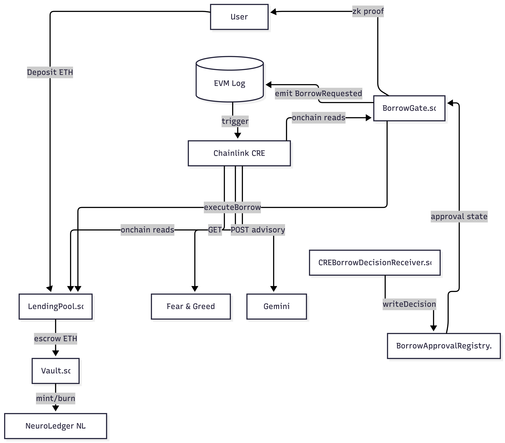

  
# 🧠 NeuroLedger 
**ZK Private Pass-Gated Lending + Chainlink CRE Risk Orchestration**

NeuroLedger is a next-generation decentralized lending protocol on **Ethereum Sepolia**. 
Borrowing is intelligently gated by a **zkPass ZK Proof** (for privacy-preserving allowlisting) and dynamically orchestrated by the **Chainlink Runtime Environment (CRE)**, which fuses on-chain solvency checks with **Google Gemini AI** and off-chain market sentiment to make secure, deterministic loan approvals.

[Live Demo](https://www.neuroledgers.com/#/zk-private-lending) • [Demo Video](#) • [Chainlink Faucet](https://faucets.chain.link/sepolia)

---

## 🌟 Key Features

1. **Privacy-Preserving Access (zkPass)**: Borrowers prove their authorization to access the lending pool using zero-knowledge proofs (Groth16) via Merkle membership and nullifiers. No sensitive Web2 data or identity is exposed on-chain.
2. **Intelligent Risk Orchestration (Chainlink CRE)**: The Chainlink Runtime Environment acts as the off-chain "brain" of the protocol. It listens to EVM events, gathers precise on-chain context (Debt, Collateral Value, Health Factor), and orchestrates the risk evaluation computationally.
3. **AI-Driven & Market-Aware Decisions**: The CRE workflow queries the **Alternative.me Fear & Greed Index** to gauge macro market conditions and feeds this data into **Google Gemini LLM** to generate an intelligent, advisory risk score.
4. **Secure Asynchronous Execution**: Protocol security is split into two phases. The `BorrowGate` pauses loan execution until the CRE workflow explicitly writes a cryptographically signed approval to the `BorrowApprovalRegistry` via the `CREBorrowDecisionReceiver`.

---

## 🏗️ System Architecture

NeuroLedger seamlessly blends complex on-chain invariants with off-chain artificial intelligence via the Chainlink Oracle Network.

---

## 📜 Smart Contracts Overview

All contracts are deployed on the Ethereum Sepolia Testnet.

| Contract | Role / Description |
| :--- | :--- |
| **`LendingPool.sol`** | The core accounting logic. Enforces strict Health Factor (HF) solvency invariants to ensure the protocol remains fully collateralized. |
| **`Vault.sol`** | The protocol treasury. Securely escrows ETH collateral and holds exclusive minting/burning authority over the NeuroLedger (NL) ERC20 token. |
| **`BorrowGate.sol`** | The entry point for loans. Validates ZK proofs and initiates the 2-step async borrow flow (`requestBorrow` -> CRE decision -> `executeBorrow`). |
| **`BorrowApprovalRegistry.sol`** | The decision ledger. Stores the approve/reject status, reason codes, and AI risk scores generated by the CRE, keyed securely by the user's ZK nullifier. |
| **`CREBorrowDecisionReceiver.sol`** | Chainlink consumer module that implements `IReceiver.onReport`. Receives cryptographically signed reports from the Chainlink network. |
| **`ZKPassVerifier.sol`** | A Groth16 SnarkJS Verifier used to guarantee the user holds a valid privacy pass without revealing their identity. |

---

## 🛠️ Chainlink CRE Workflow

NeuroLedger leverages the **Chainlink Runtime Environment (CRE)** to bridge the gap between smart contracts and Web2 data.

- **Trigger**: The workflow is triggered by the EVM Log `BorrowRequested(requestId, borrower, nullifier, amount)`.
- **Context Gathering**: The CRE actively queries the `LendingPool` to fetch the borrower's exact current financial state (ethCollateral, tokenDebt, liquidationThreshold) to project the consequences of the requested loan.
- **External Integration**: It reaches out to the [Alternative.me API](https://alternative.me/crypto/fear-and-greed-index/) and the **Google Gemini API**.
- **Execution Engine**: The TypeScript `main.ts` file acts as a deterministic rules engine. It will explicitly reject loans if the market is in extreme fear, if the loan amount is too high, or if the projected Health Factor falls below the protocol's safety margin.

### 🔗 Required Chainlink Hackathon Links

- **CRE project config:** [`project.yaml`](./workflows/zkpass-risk-orchestrator/project.yaml)
- **Workflow definition:** [`workflows/zkpass-risk-orchestrator/workflow.yaml`](./workflows/zkpass-risk-orchestrator/workflow.yaml)
- **Workflow code (TypeScript):** [`workflows/zkpass-risk-orchestrator/main.ts`](./workflows/zkpass-risk-orchestrator/main.ts)
- **Workflow configs:**
  - [`config.staging.json`](./workflows/zkpass-risk-orchestrator/config.staging.json)
  - [`config.production.json`](./workflows/zkpass-risk-orchestrator/config.production.json)
- **Secrets manifest:** [`secrets.yaml`](./workflows/zkpass-risk-orchestrator/secrets.yaml)
- **Chainlink consumer contract:** [`contracts/contracts/CREBorrowDecisionReciever.sol`](./contracts/contracts/CREBorrowDecisionReciever.sol)

---

## Hackathon Requirements Checklist

- [x] **CRE Workflow** used as the core orchestration layer.
- [x] Integrates **at least one blockchain**: Ethereum Sepolia.
- [x] Integrates **external system / API / LLM**: Google Gemini + External Risk Signal API.
- [x] Demonstrates **successful simulation via CRE CLI**.
- [x] **Public GitHub repo**.
- [x] README includes **links to all Chainlink-related files**.
- [ ] 3–5 minute **public demo video** showing workflow execution (app + CLI simulate).

---

## 💻 Tech Stack

- **Smart Contracts:** Solidity, Hardhat, OpenZeppelin
- **Oracle / Off-Chain Compute:** Chainlink CRE (Chainlink Runtime Environment), TypeScript
- **Zero-Knowledge:** zkPass, Circom, SnarkJS (Groth16)
- **Frontend:** Next.js, React, TailwindCSS, viem
- **AI Integration:** Google Gemini REST API

---

*Built with passion for the Chainlink Convergence Hackathon 2026. 🔗*
