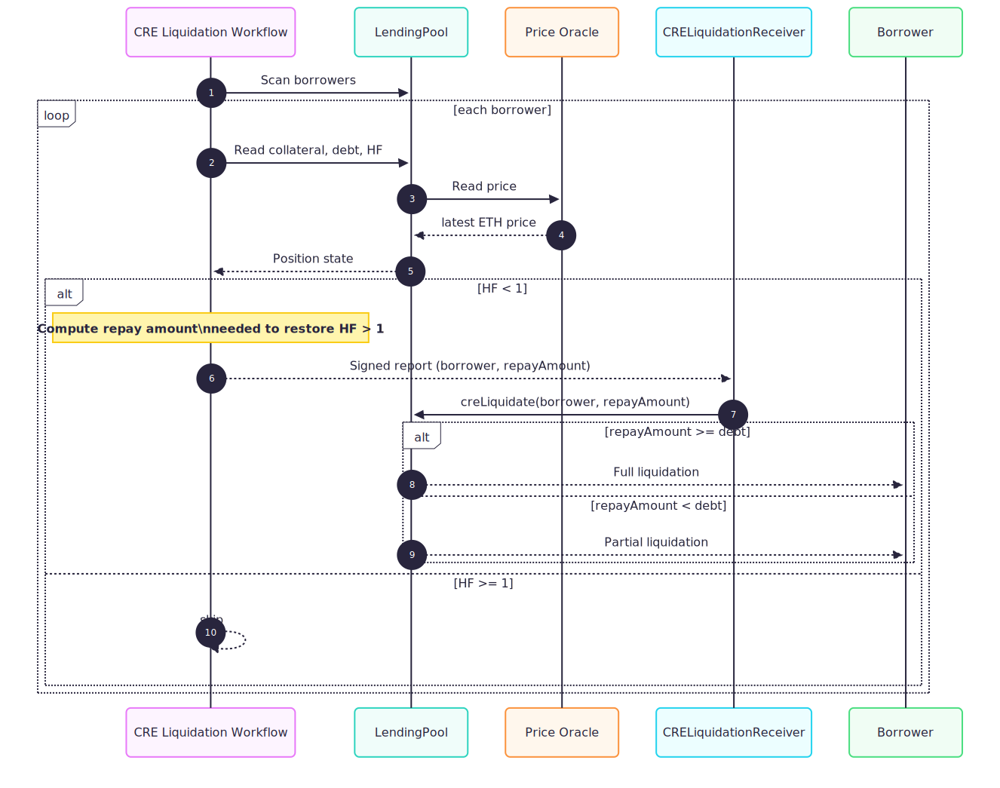

# NeuroLedger
### ZK Private-Pass Gated Lending + Chainlink CRE Risk Orchestration + CRE Liquidation Keeper

**Live App:** https://www.neuroledgers.com/#/zk-private-lending  
**Demo Video (3–5 min):** _(add link)_  
**Network:** Ethereum Sepolia

---

## ✅ What this project is 

NeuroLedger is a **policy-aware lending protocol**:

- **ZK Proof** gates who can borrow (private allowlist / zk-pass)
- **Chainlink CRE** acts as a decentralized orchestration layer:
  - **Borrow Risk Workflow (event-driven):** listens to `BorrowRequested` and writes approve/reject on-chain
  - **Liquidation Workflow (cron-driven):** periodically sweeps positions, checks Health Factor, computes min repay needed to restore solvency, and triggers partial/full liquidations
- **On-chain contracts enforce execution** (BorrowGate + BorrowApprovalRegistry + LendingPool), using **oracle-backed pricing** for HealthFactor.

> Design principle: **policy vs execution separation**  
> CRE computes risk policy off-chain; smart contracts enforce solvency + execution deterministically on-chain.

---
# 🔗 Chainlink CRE Workflows (REQUIRED LINKS)

## 1) Borrow Risk Orchestrator (event-driven)
- CRE project config: [project.yaml](./workflows/project.yaml)
- Secrets manifest: [secrets.yaml](./workflows/secrets.yaml)
**Workflow Dir:** [cre-borrow-orchestrator](./workflows/zkpass-risk-orchestrator/)
- Workflow definition: [workflow.yaml](./workflows/zkpass-risk-orchestrator/workflow.yaml)
- Workflow code:
  - Entry: [index.ts](./workflows/zkpass-risk-orchestrator/index.ts)
  - Supporting modules (split files): [evm.ts,http.ts,decision.ts,prompt.ts,types.ts,utils.ts,report.ts](./workflows/zkpass-risk-orchestrator/)
- Workflow configs:
  - [./workflows/zkpass-risk-orchestrator/config.staging.json](./workflows/zkpass-risk-orchestrator/config.staging.json)

## 2) Liquidation Orchestrator (cron-driven)
**Workflow Folder:** [liquidation-orchestrator](./workflows/liquidation-orchestrator/)

- Workflow definition: [workflow.yaml](./workflows/liquidation-orchestrator/workflow.yaml)
- Workflow code:
  - Entry: [index.ts](./workflows/liquidation-orchestrator/index.ts)
  - Supporting modules (split files): [evm.ts,math.ts,report.ts,discover.ts](./workflows/liquidation-orchestrator/)
- Workflow configs:
  - [./workflows/liquidation-orchestrator/config.staging.json](./workflows/liquidation-orchestrator/config.staging.json)

## Chainlink Consumer Contracts (Receivers)
- Borrow decision receiver: `./contracts/contracts/CREBorrowDecisionReceiver.sol`
- Liquidation receiver : `./contracts/contracts/CRELiquidationReceiver.sol` 
---
---

## 🏗️ System Architecture (diagram)

---

## 🔁 Borrow Flow (diagram + summary)

**Steps:**
1) User generates/uploads ZK proof with: `amount, root, nullifier, nonce` + `a,b,c`
2) `BorrowGate.requestBorrow()` verifies proof + emits `BorrowRequested(requestId, borrower, nullifier, amount)`
3) **CRE Borrow Risk Workflow** triggers and performs:
   - On-chain context reads (HF projection, LTV, debt, collateral)
   - External API: Fear & Greed
   - LLM: Gemini risk score (`riskScoreBp`)
   - Decision rule: approve only if **riskScoreBp < 8000** AND deterministic checks pass
4) CRE writes signed report → `CREBorrowDecisionReceiver` → `BorrowApprovalRegistry`
5) User calls `BorrowGate.executeBorrow(requestId)` → checks registry decision
6) If approved, `LendingPool.borrowFor()` transfers NL to borrower

---

## 🔥 Liquidation Flow (diagram + summary)

**Steps:**
1) **CRE Liquidation Workflow** runs on cron
2) It scans borrower positions and checks `HealthFactor(user)` (< 1 means unsafe)
3) Uses **oracle price feed** (via LendingPool) for collateral valuation / HF math
4) Computes **minimum repay** required to restore HF > 1
5) Sends report to protocol receiver / executes `LendingPool.creLiquidate(borrower, repayAmount)`
6) LendingPool enforces:
   - if `repayAmount >= debtNL` → full liquidation
   - else → partial liquidation (seize proportional collateral)

---

## 🛡 Guardrails & Trust Boundaries 

**Core safety invariants:**
- No valid ZK proof → no borrow request accepted
- Nullifier replay blocked
- Borrow execution blocked unless registry decision is approved
- HF + solvency math enforced by LendingPool
- Liquidation is deterministic on-chain (full vs partial rules)
- CRE is bounded by receiver + contract logic (policy computed off-chain, enforced on-chain)

---

## 📜 Smart Contracts (Sepolia)

| Contract | What it does |
|---|---|
| `BorrowGate.sol` | ZK-gated borrow entrypoint (`requestBorrow` → `executeBorrow`) |
| `ZKPassVerifier.sol` | Groth16 verifier (validates proof) |
| `BorrowApprovalRegistry.sol` | Stores decision by `nullifier` (approved/reason/riskScore/ltv/decidedAt) |
| `CREBorrowDecisionReceiver.sol` | Consumes CRE reports and writes decisions to registry |
| `LendingPool.sol` | Core accounting + HealthFactor + liquidation execution (`borrowFor`, `creLiquidate`) |
| `Vault.sol` | Escrows collateral |
| `NL.sol` | ERC-20 token borrowed by users |
| `CRELiquidationReciever.sol` | triggers liquidation 

---

# ✅ Hackathon Requirements Checklist (explicit)

- [x] **Project description covers use case + stack/architecture**
- [x] **3–5 min public demo video** (app execution OR CLI simulate)  
- [x] **Public GitHub repo**
- [x] **README links to all Chainlink-related files** (above)
- [x] **CRE workflow used in the project**
- [x] Workflow integrates:
  - [x] **Blockchain:** Ethereum Sepolia
  - [x] **External system:** Alternative.me Fear & Greed API
  - [x] **LLM:** Gemini API
- [x] Demonstrates:
  - [x] **Successful CRE CLI simulation** 

---
